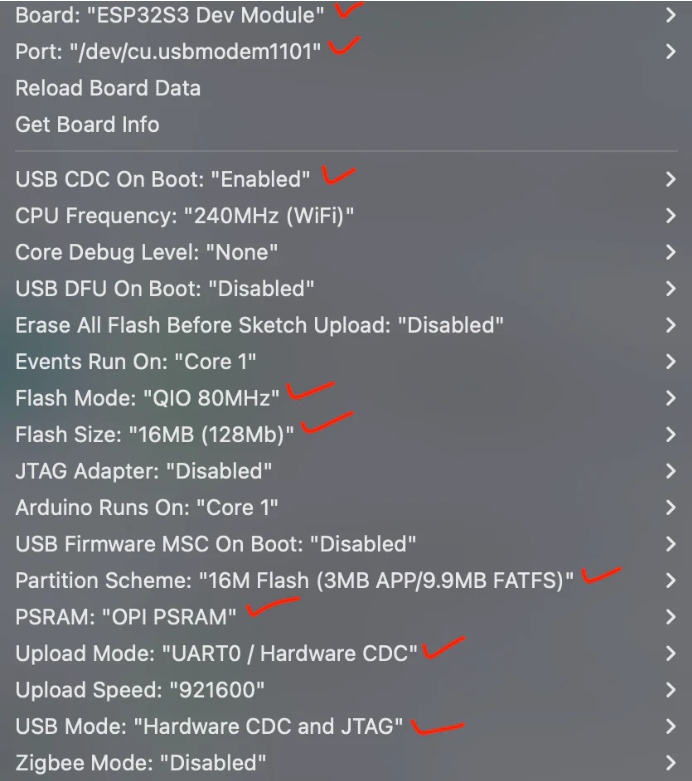

### Notes for Arduino S3

### Necessary pins for screen communication

You can test what each pin is by:

    Serial.printf("SCL: %d", SCL);

For I2C  
SCL: PIN 9  
SDA: PIN 8  

For SPI  
SCK: 12  (SCK on TFT)   
MOSI: 11 (SDA on TFT)   
MISO: 13    
SS: 10

### Code to know where the device is stored
    #include <Wire.h>
    #include <Adafruit_GFX.h>
    #include <Adafruit_SSD1306.h>

    #define SCREEN_WIDTH 72
    #define SCREEN_HEIGHT 40

    Adafruit_SSD1306 oled(SCREEN_WIDTH, SCREEN_HEIGHT, &Wire, -1);

    void setup()
    {
    // put your setup code here, to run once:
    Serial.begin(115200);
    Wire.begin();
    }

    void loop()
    {
    byte error, address;
    int nDevices;

    Serial.println("Scanning...");

    nDevices = 0;
    for(address = 1; address < 127; address++ )
    {
        Wire.beginTransmission(address);
        error = Wire.endTransmission();

        if (error == 0)
        {
        Serial.print("I2C device found at address 0x");
        if (address < 16)
            Serial.print("0");

        Serial.print(address,HEX);
        Serial.println("  !");

        nDevices++;
        }
        else if (error==4)
        {
        Serial.print("Unknown error at address 0x");
        if (address < 16)
            Serial.print("0");

        Serial.println(address,HEX);
        }
    }

    if (nDevices == 0)
        Serial.println("No I2C devices found");
    else
        Serial.println("done");

    delay(5000); // wait 5 seconds for next scan
    }

### "Circuits"

#### TFT to arduino

- GND -> GND
- VCC -> 3.3V
- SCL -> SCK(GPIO 12)
- SDA -> MOSI(GPIO 11)
- RST -> Any free GPIO or not connected (-1)
- DC -> Any free GPIO (6)
- CS -> SS (GPIO 10)
- BL -> 3.3V or any PWM GPIO (8)

When it comes to the arrays used in this project we'll have example[] PROGMEM, the PROGMEM keyword makes it so it is stored in flash memory rather than ram memory 

16MB Flash, 8MB PSRAM

TFT and/or arduino expect BRG colors rather than RGB